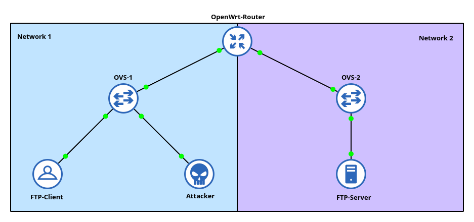

# ARP-poisoning Lab

## Overview

This lab is intended to be a simplified representation of an enterprise network. This is divided into two networks each:  
Network 1 should resemble an office network used by the employees. Because clients fluctuate frequently, IP addresses are assigned by a DHCP server. Our victim and the attacker are also located in this network. The victim tries to download data to and from an FTP server located on the second network. Only the company's servers are located in this second network, which is why all clients have been assigned a fixed IP address. The attacker now tries to establish a position between the victim and the FTP server so that the attacker can control all traffic between the two. To achieve this, he has three different ARP-poisoning tools at his disposal: Ettercap, Scapy and ARPing.

| Role     | Purpose    | Software                | Virtualization-typ |
| -------- | ---------- | ----------------------- | ------------------ |
| Attacker | MITM       | Ettercap, Scapy, ARPing | Docker             |
| Victim   | FTP-Client | FileZilla               | Docker             |
| Server   | FTP-Server | vsFTPd                  | Docker             |
| Switch   | Switch     | Open vSwitch            | Docker             |
| Router   | Router     | OpenWrt                 | Qemu               |

## Installation

> :information_source: Tested with GNS3 2.2.37 under Linux native, as well as with the GNS3 VM using VirtualBox 7.0.6.

1. Install GNS3 by following these instructions: [Linux](https://docs.gns3.com/docs/getting-started/installation/linux) / [Windows](https://docs.gns3.com/docs/getting-started/installation/windows)

2. Download the file *arp-poisoning.gns3project* from the repo. 

3. Open GNS3 and select the previously downloaded file under *File > Import portable project*. Then select a desired location and press OK. The project will now be imported, thereby various Docker containers will be downloaded from Dockerhub, which is why the import can take a few minutes.

   > :information_source: If you are using the GNS3 VM, you must first make sure that it is started before importing the project. This can be seen on the right side under the Server Summary.

4. Now start all nodes. It makes sense to start the router first, because it needs a few seconds before it is fully operational.
